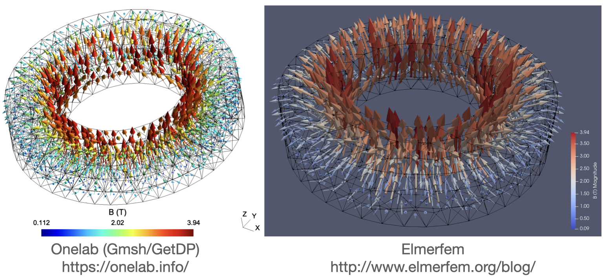

Electromagnetic model of a superconducting coil connecct to an external circuit.

A superconductinf coil can experience a sudden loss of its superconducting state and enter what is referred to as a quench. A quench is ignited by a local dissipation of energy within the body of the coil and a rapid heat dissipation occurs leading to a propgating heat fron throughout the coil infusing further dissipation. All the magnetic energy stored in the coil is released. To avoid the burnout of the coil, a detection and protection system is required to detect quickly the quench and act upon it by dumping the coil energy in an external resistor. The FEM model deals with the electromagnetic and thermal behavior of the coil while the external circuit model deals with the energy and dumping of the coil.

The external circuit is made of a DC power source supplying a current to a coil modelling by FEM in parallel with an external resistance. A resistance, repesenting the current leads, is provided in the circuit between the power supply and the coil. Two control "k1" and "k2" are shown in case it is required to model the switching between one part of the circuit and the other (C1a and C1b) upon a condition in the voltage across the coil. it is part of a classic detection and protection system for superconducting coils.

Check on the computation of the magnetic field on the coil:
- Comparison Elmerfem and Onelab (Gmsh/GetDP) assuming a constant current density Je = 1e8 A/m^2¡

