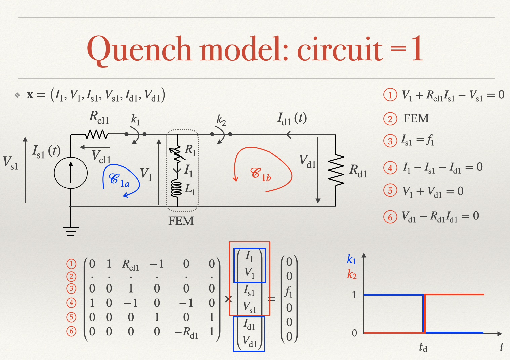
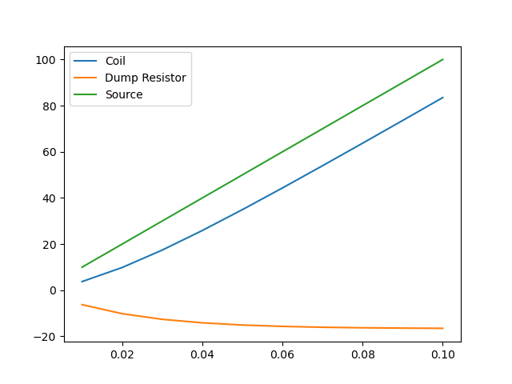
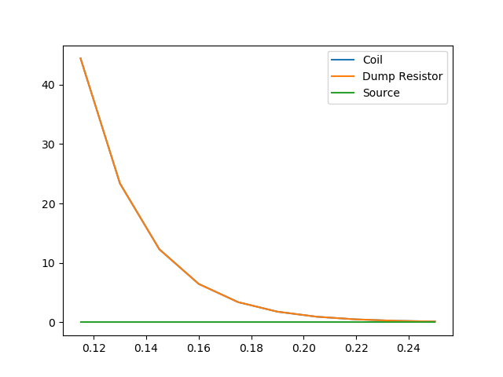

# NOTES!!!

Run in bash mode: bash run.sh

# Electromagnetic model of a superconducting coil connected to an external circuit.

Background: A superconducting coil can experience a sudden loss of its superconducting state and may enter what is referred to as a "quench". A quench is ignited by a local dissipation of energy within the body of the coil followed by a rapid heat dissipation leading to a propagating heat front throughout the winding infusing further dissipation. All the magnetic energy stored in the coil is then released within the body of the coil. To avoid the burnout of the coil, a detection and protection system is required to detect quickly the quench and act upon it by dumping the coil energy in an external resistor. The FEM model deals with the electromagnetic and thermal behavior of the coil while the external circuit model deals with the energy and dumping of the coil energy.

The external circuit is made of a DC power source supplying a current to a coil modeled by FEM in parallel with an external resistance. A resistance, repesenting the current leads, is provided in the circuit between the power supply and the coil. Two control "k1" and "k2" are shown in case it is required to model the switching between one part of the circuit and the other (C1a and C1b). The detection uses the voltage across the coil as a threshold on the activation of the protection system (dump resistor). It is part of the classic detection and protection schemes for superconducting coils.

Verification of the calculation of the magnetic field on the coil:
- Comparison Elmerfem and Onelab (Gmsh/GetDP) assuming a constant current density Je = 1e8 A/m^2

Electrical circuit for the entire system including the coil, the power supply and the dump resistor:

# Testing the electrical circuits

The problem is divided in two parts (reproduce with "run.sh"):

1. Current ramp up to 100 A (coil.sif) that gives about 5.5 T peak field. However, the ramp is 1000 A/s and thus some current is
   pushed to the dump resistor as well.

2. Energy extraction via dump resistor in 150 ms.

